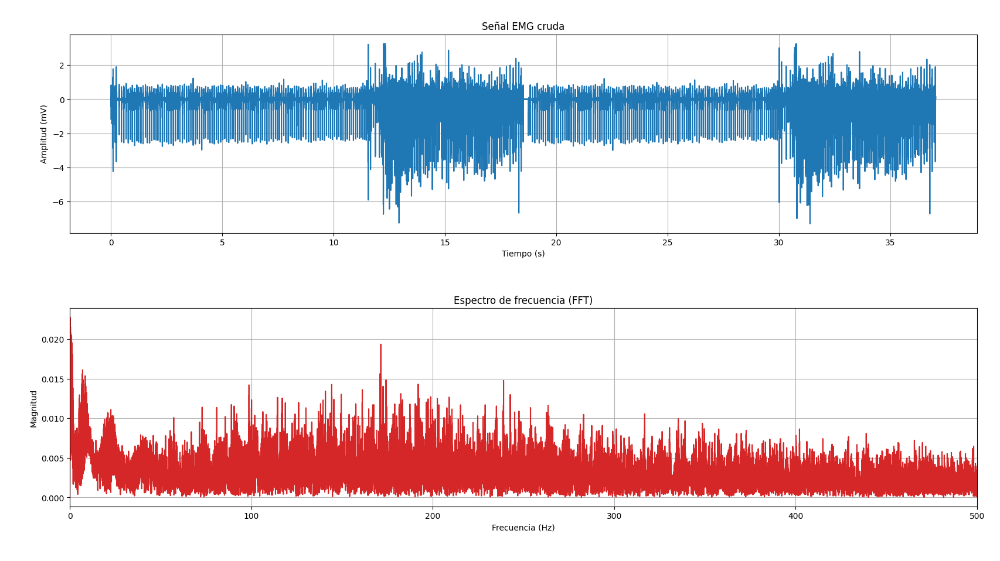
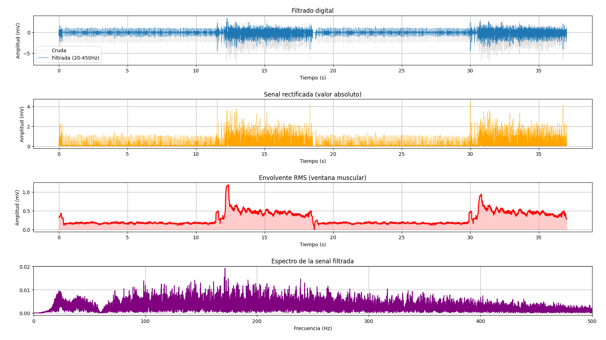
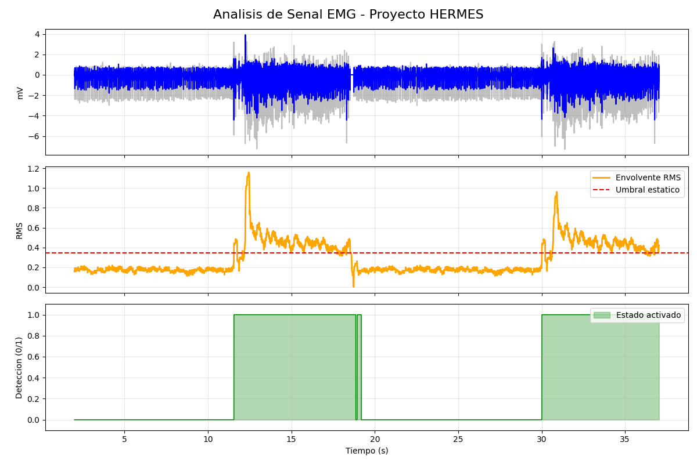

# HERMES: High-Efficiency Real-time Muscle Extraction System

**HERMES** es un ecosistema de procesamiento de señales electromiográficas (EMG) desarrollado por **IN-NOVA BIO**. El proyecto está diseñado para convertir actividad muscular en comandos digitales, sirviendo como base para interfaces de comunicación asistida (AAC) accesibles y de baja latencia.

---

## 🚀 Flujo de Desarrollo y Validación
El sistema se ha desarrollado siguiendo una metodología de dos etapas para garantizar la fiabilidad de los algoritmos:

### 1. Validación en Python (Sandbox de Investigación)
Utilizado como prueba de concepto inicial empleando bases de datos de **PhysioNet** (*Examples of Electromyograms*). 
* **Objetivo:** Validar la calidad del filtrado (Notch y Bandpass) y prototipar la lógica de la envolvente RMS.
* **Metodología:** Procesamiento por lotes (Batch Processing) para análisis estadístico global y visualización detallada del espectro de frecuencia (FFT).

### 2. Implementación en C++ (Motor "Ready-for-Real-Time")
Tras la validación en Python, los algoritmos se trasladaron a C++ bajo una arquitectura de **procesamiento muestra a muestra**. Esta versión está diseñada para implementarse directamente en una **ESP32**.
* **Diferencia Clave:** A diferencia de la versión en Python, este código no requiere la señal completa para operar. Utiliza **Buffers Circulares** y una fase de **Calibración Dinámica** de 2 segundos al inicio.
* **Estado:** Validación offline completada con éxito, listo para integración con periféricos de hardware (teclado HID/BLE).

---

## ⚙️ Arquitectura del Pipeline Digital
El motor de C++ implementa un pipeline de procesamiento digital de señales (DSP) de alta eficiencia:

1.  **Filtro Notch (60 Hz):** Implementado mediante estructura **Biquad IIR** para eliminar ruido de línea.
2.  **Filtro Bandpass (20-450 Hz):** Butterworth de 4º orden (cascada de Biquads) diseñado mediante transformación bilineal.
3.  **Envolvente RMS:** Cálculo de energía en tiempo real con complejidad $O(1)$ mediante acumuladores y buffers circulares.
4.  **Detección Binaria con Debouncing:** Lógica de estado con *Hold Time* para asegurar pulsaciones de comando limpias y sin rebotes.

---

## 📊 Eficiencia y Rendimiento
- **Procesamiento de Muestra:** < 15 µs (estimado en ESP32 a 240MHz).
- **Calibración:** Automática y adaptable al ruido de fondo en los primeros 2s de ejecución.
- **Estabilidad:** Filtros diseñados en **Forma Directa II Transpuesta** para prevenir errores de precisión numérica en punto flotante de 32 bits.
- **Portabilidad:** Código compatible con el estándar C++17, fácilmente integrable en entornos Arduino/Espressif.

---

## 📊 Resultados y Validación
Se realizó una comparativa entre la señal cruda y el procesamiento final del motor HERMES. Como se observa en la siguiente gráfica, el sistema logra aislar la intención del usuario eliminando el ruido base y los artefactos de red eléctrica.

### Observaciones clave:
* **Análisis de Fourier:** Identificación de armónicos de la red eléctrica (60 Hz) y validación del ancho de banda de la señal EMG antes y después del filtrado.

* **Filtrado:** Eliminación exitosa del offset DC, ruido de 60Hz y filtrado Bandpass (20-450 Hz).

* **Detección:** La lógica de *Hold Time* permite una señal de control (verde) estable, ideal para la emulación de teclas o comandos AAC, evitando activaciones intermitentes.

* **Comparativa (C++):** Filtrado y detección mediante procesamiento muestra a muestra en C++.

## 🧩 Estructura del Proyecto
- `Signal_processing.py` → Scripts de validación inicial y análisis de FFT con PhysioNet.
- `HERMES.cpp` → Código optimizado para ejecución muestra a muestra (Motor HERMES).
- `examples-of-electromyograms-1.0.0` → Señales de prueba (Neuropatía, Miopatía y Control).
- `plot_results.py` → Graficación de de resultados obtenidos a través de HERMES.cpp

---

## 🎯 Objetivo e IN-NOVA BIO
HERMES busca democratizar el acceso a tecnologías asistivas. Al utilizar hardware comercial (como el sensor Myoware y la ESP32) junto con este motor de procesamiento optimizado, logramos un sistema robusto, no invasivo y adaptable a las necesidades de cada usuario.

